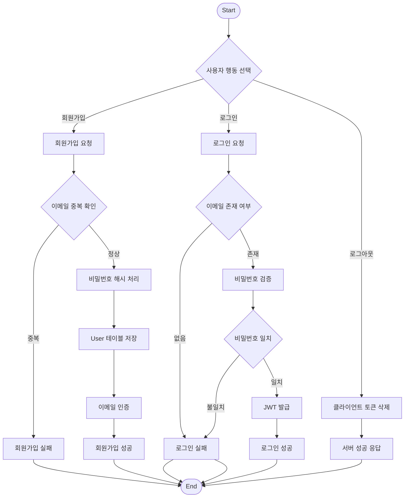

# Don't Drop money, Safe Your money

프로젝트 명 : 당신의 지갑을 안전하게, Don't Drop money, Safe Your money ( 돈두세요 )

- 팀명 : 코로나(Corona)
- 팀장 : 김병준
- 팀원 : 김병준, 장수영, 정상운

개발환경


<pre style="font-size: 15px;">
- IDEA : PyCham
- API : Django Rest Framework
- Deploy : Docker
- CI / CD : GitHub Actions
- Version Manage : UV
- DB : PostgreSQL
</pre>

# 0. ERD


| 테이블 이름        |	설명 |	주요 필드 (구성 요소) |
|---------------| -- | --- |
| User          |	사용자의 기본 계정 정보를 관리하는 테이블입니다. |	user_id (PK), user_name, email, password_hash, is_admin, created_at, updated_at
| Account       |	유저가 보유한 계좌 정보(자산)를 저장하는 테이블입니다. |	account_id (PK), account_name, type, bank_code, balance, is_active, created_at, updated_at
| Transaction   |	사용자가 보유한 계좌의 개별 거래 내역을 저장하는 테이블입니다. |	transaction_id (PK), amount, currency, transaction_type, memo, transaction_date, created_at, updated_at
| Notification      |	사용자에게 전달되는 시스템 및 이벤트 알림 관리 테이블입니다. |	notification_id (PK), title, content, notification_type, is_read, created_at, updated_at, read_at
| Schedule |	반복되는 정기 거래(예약 내역)를 관리하는 테이블입니다. |	schedule_id (PK), title, amount, currency, transaction_type, memo,repeat_type, start_date, end_date, is_active, created_at, updated_at
| category      |	수입 및 지출의 항목을 분류하기 위한 테이블입니다. |	category_id (PK), category_name, created_at, updated_at


# 1. 요구사항 분석
```
1.  회원가입 / 회원정보 관리 (User)

-   사용자는 이메일(email), 유저명(user_name/username),
    비밀번호(password_hash)를 기반으로 서비스에 가입한다.
-   사용자가 가입하면 입력 정보가 저장되어 User 테이블에 새로운 user
    레코드(user_id PK)가 생성된다.
-   사용자는 본인의 계정 정보만 조회할 수 있다.
-   사용자는 본인의 유저명/이메일 등을 수정할 수 있으며 수정 시
    updated_at이 갱신된다.
-   회원 생성 시 created_at이 기록된다.
-   회원 탈퇴는 비활성화 처리로 진행할 수 있으며, 이 경우 이후 기능
    접근이 제한된다.
-   관리자는 회원정보를 수정 / 삭제 할 수 있다.

2.  로그인 / 로그아웃

-   사용자는 이메일(email)과 비밀번호로 로그인한다.
-   비밀번호는 password_hash 값으로 검증한다.
-   로그인 성공 시 인증 토큰(JWT 등)을 발급하여 이후 요청에 인증을
    적용한다.
-   로그아웃 시 클라이언트는 토큰을 폐기한다.

3.  계좌 생성 및 관리 (Account)

-   사용자는 가계부에 사용할 계좌(Account)를 생성할 수 있다.
-   계좌 생성 시 계좌명(name), 계좌 타입(type), 은행명(bank_code),
    통화(currency), 초기 잔액(balance)을 입력한다.
-   계좌가 생성되면 Account 테이블에 account_id(PK)가 생성되고, 해당
    계좌는 user_id(FK)로 사용자에 귀속된다.
-   사용자는 자신의 계좌 목록을 조회할 수 있다.
-   계좌 수정 시 updated_at이 갱신된다.
-   계좌 삭제는 is_active를 false로 변경하는 비활성화 방식으로 처리할 수
    있다.

4.  카테고리(수입/지출의 항목 분류) 생성 및 관리 (Category)

-   관리자 권한을 가진 사용자는 카테고리를 생성/수정할 수 있다.
-   카테고리 생성 시 category_name과 category_type을 입력한다.
-   생성 시 category_id(PK)가 생성되고 created_at이 기록된다.
-   카테고리 수정 시 updated_at이 갱신된다.
-   거래 / 스케줄 생성 시 memo의 문자열을 추출해 자동으로 카테고리를 분류한다.

5.  거래 생성 및 관리 (Transaction)

-   사용자는 특정 계좌에서 발생한 거래(Transaction)를 등록할 수 있다.
-   거래 등록 시 amount, transaction_type, memo, transaction_date를
    입력한다.
-   거래 생성 시 transaction_id(PK)가 생성되며 user_id, account_id,
    category_id가 함께 저장된다.
-   거래 수정 시 updated_at이 갱신된다.
-   거래 삭제 시 데이터 무결성을 유지하도록 처리한다.

6.  계좌 잔액 반영 규칙

-   거래 등록 시 transaction_type에 따라 Account.balance를 증가 또는
    감소시킨다.
-   거래 수정 시 기존 반영 금액을 되돌린 후 변경된 금액을 재반영한다.
-   거래 삭제 시 반영된 금액을 되돌린다.

7.  거래 내역 조회 / 필터링

-   사용자는 자신의 거래 내역을 조회할 수 있다.
-   account_id, category_id, transaction_type, transaction_date(기간)
    조건으로 필터링 가능하다.
-   조회 시 금액, 타입, 날짜, 메모, 계좌명, 카테고리명을 함께 확인할 수
    있다.

8.  정기 거래 스케줄 등록 및 관리 (Schedule)

-   사용자는 정기 거래(Schedule)를 등록할 수 있다.
-   등록 시 title, amount, transaction_type, memo, repeat_type,
    start_date, end_date, is_active를 입력한다.
-   반복 규칙에 따라 Transaction이 자동 생성될 수 있다.
-   자동 생성된 거래는 계좌 잔액에 반영된다.

9.  알림 생성 및 관리, 읽음 처리 (Notification)
-   사용자는 알림을 생성할 수 있다.
-   관리자 권한을 가진 사용자는 한번에 모든 사용자에게 녹색 알림을 보낼 수 있다.
-   시스템은 특정 이벤트 발생 시 Notification을 생성한다.
-   특정이벤트에는 스케쥴 잔액 부족, 스케쥴 예정 및 발생시, 관리자의 공지사항 등이 있다.
-   알림 생성 시 title, content, notification_type, is_read, read_at이
    저장된다.
-   알림은 user_id로 사용자와 연결된다.
-   사용자는 자신의 알림을 조회할 수 있다.
-   알림을 읽으면 is_read가 true로 변경되고 read_at이 기록된다.

```

# 2. 테이블 관계 정리
- 각 테이블에 대한 설명과 테이블 간의 관계(1:1, 1:N, N:M 등) 정리
- Table : 사용자( User ), 계좌( Account ), 카테고리( Category ), 계좌이력( Transaction ), 스케쥴( Schedule ), 알림( Notification )


ㅁ 사용자 ( User )
---

사용자 : 계좌  = 1 : N
 - 한 명의 사용자는 여러개의 계좌를 가질 수 있습니다. ( 0개의 계좌 가능 )
 ---
사용자 : 카테고리 = None
 - 서로 직접적인 관계가 없기 때문에 관계성이 성립하지 않습니다.
 ---
사용자 : 계좌 이력 = 1 : N
- 한 명의 사용자는 여러개의 계좌 이력을 가질 수 있습니다. ( 0개의 계좌이력 가능 )

 ---
사용자 : 스케쥴 = 1: N
- 한 명의 사용자는 여러개의 스케쥴을 가질 수 있습니다. ( 0개의 스케쥴 가능 )

 ---
사용자 : 알림 = 1 : N
- 한 명의 사용자는 여러 개의 알림을 가질 수 있습니다. (0개의 알림 가능)
- N : M인지 1 : N인지에 대한 혼동이 있었으나,
Notification 테이블은 사용자별 읽음 상태(is_read, read_at)를 관리해야 하는 개별 데이터이므로,
하나의 알림은 한 사용자에게 귀속되고,
한 사용자는 여러 알림을 가질 수 있어 1:N 관계입니다.

ㅁ 계좌 ( Account )
---
계좌 : 사용자 = N : 1
- 계좌는 하나의 사용자만을 가질 수 있다.

- 계좌와 사용자의 관계가 1:1 관계인지, N:1 관계인지에 대한 논의가 있었다.
일부 의견에서는 “하나의 계좌는 하나의 사용자만 가질 수 있다” 라는 이유로 1:1 관계라는 주장이 제기되었다.
여기에서 말하는 계좌는 단일 계좌(유일한 하나의 계좌)를 의미하는 것이 아니라,
사용자가 생성할 수 있는 여러 개의 계좌(Account 엔티티)를 의미한다.


- "공동명의 계좌가 있지 않나?"에 대해서 논의가 있었다.
대표자 1인에게 귀속되는 단일 사용자 계좌로 처리하는 것이 합리적이라는 결론이 도출되었다.
(즉, 공동 소유(N:M) 구조는 고려하지 않는다.)

---
계좌 : 카테고리 = None
- 계좌와 카테고리는 직접적인 관계가 없기 때문에 관계성이 성립하지 않습니다.

---
계좌 : 계좌 이력 = 1 : N
- 하나의 계좌는 여러 계좌 이력을 가질 수 있습니다. ( 0개의 계좌 이력 가능 )
- 더치페이인 경우 N : M 으로 될 수 있지않은가?
라는 대화주제가 오갔지만, 우리가 구현할 서비스에서  N : M 일 경우 중복된 데이터가 많아지고
이는 곧 효율성을 떨어뜨린다. 따라서 N : M의 구조는 고려하지않는다.


---
계좌 : 스케쥴 = 1 : N
- 하나의 계좌는 여러 개의 스케줄을 가질 수 있다.
- 스케줄(Schedule)은 계좌와 사용자 중 어디에 속하는가? 라는 설계 관점의 논의가 있었다.
"한 사용자는 여러 개의 스케줄을 가질 수 있다.", "하나의 스케줄은 반드시 한 명의 사용자에 속한다."
스케줄의 “실행 대상”은 계좌, 스케줄의 “소유 주체”는 사용자
따라서 핵심 귀속 관계는 1:N이 도출되었다.

---
계좌 : 알림 = None
- 계좌와 알림는 직접적인 관계가 없기 때문에 관계성이 성립하지 않는다.
- “잔액 부족 알림은 계좌에 대한 알림 아니냐?”에 대해
그 알림은 계좌에게 가는 게 아니라 사용자에게 가는 것이기에 계좌와 알림은 관계성이 성립하지 않는다.

ㅁ 카테고리 ( Category )
---
카테고리 : 계좌 이력 = 1 : N
- 카테고리는 여러 개의 계좌 이력을 가질 수 있다. ( 0개의 계좌 이력 가능 )

---

카테고리 : 스케쥴 = 1 : N
- 하나의 카테고리는 여러 개의 정기 스케줄에 사용될 수 있다. (0개의 스케쥴 사용 가능)


# 3. JWT 인증 로그인


Refresh Token으로만 Access Token 생성이 가능하고

Access Token이 검증되면 Pass,

Refresh Token이 검증되면 Refresh Token으로
Access Token을 생성한 뒤 검증 후 Pass

Refresh Token이 만료되었거나 검증되지 못하면
로그인을 요청해 Refresh Toekn을 재발급받게 한다.

## 테이블 구성

| 테이블 이름 | 설명 | 주요 필드 |
|-------------|------|------------|
| User | 사용자의 기본 계정 정보를 관리하는 테이블입니다. | user_id (PK), user_name, email, password_hash, is_admin, created_at, updated_at |
| Account | 유저가 보유한 계좌 정보를 저장합니다. | account_id (PK), account_name, type, bank_code, balance, is_active, created_at, updated_at |
| Transaction | 계좌의 개별 거래 내역을 저장합니다. | transaction_id (PK), amount, currency, transaction_type, memo, transaction_date, created_at, updated_at |
| Notification | 시스템 및 이벤트 알림을 관리합니다. | notification_id (PK), title, content, notification_type, is_read, created_at, updated_at, read_at |
| Schedule | 반복되는 정기 거래를 관리합니다. | schedule_id (PK), title, amount, currency, transaction_type, memo, repeat_type, start_date, end_date, is_active, created_at, updated_at |
| Category | 수입 및 지출 항목을 분류합니다. | category_id (PK), category_name, created_at, updated_at |

---

# 4. 사용자 인증 설계 (Mission 1)

## 인증 방식

- 인증 방식 : **JWT 기반 인증**
- 로그인 성공 시 Access Token 발급
- 이후 요청은 `Authorization: Bearer <access_token>` 방식으로 인증
- 로그아웃 시 클라이언트에서 토큰을 삭제

※ 현재 ERD 구조상 서버는 토큰을 별도로 저장하지 않으므로
로그아웃은 클라이언트 측 토큰 삭제 방식으로 처리합니다.

---

## 인증 플로우차트




---

# 5. Celery 

## app.task vs shared_task 차이

@app.task

- 특정 : Celery 앱 인스턴스(celery_app)에 직접 등록된다.

- 프로젝트가 “앱 인스턴스 1개”로 고정이고, 명시적으로 관리하고 싶을 때 좋다.

@shared_task

- “현재 로딩된 Celery 앱”에 자동으로 붙는 재사용 가능한 task.

- Django에서 autodiscover_tasks()랑 궁합이 좋아서, 각 앱(analysis/tasks.py)에 task 넣기 편하다.

## 정리
@app.task
- 명확함, 통제력여러 개의 Celery 앱을 동시에 돌리거나, 100% 통제된 테스트 환경이 필요할 때


@shared_task 
- 편리함, 범용성일반적인 Django 프로젝트, 앱(App) 단위로 코드를 분리할 때

---
# Celery Scheduling

### Background Run
Celery Worker와 Beat를 백그라운드로 실행하여 스케줄링 작업이 동작하는지 확인했다.

```bash
mkdir -p logs

# worker
nohup uv run celery -A config.celery:app worker -l info > logs/celery_worker.log 2>&1 &

# beat
nohup uv run celery -A config.celery:app beat -l info > logs/celery_beat.log 2>&1 &

# check
tail -n 50 logs/celery_worker.log

# Result
[2026-02-25 18:28:00,007: INFO/MainProcess] Task analysis.tasks.run_daily_total_expense_analysis[e8c9007e-4678-480f-838f-d0bd023528d3] received
[2026-02-25 18:28:00,152: INFO/ForkPoolWorker-8] Task analysis.tasks.run_daily_total_expense_analysis[e8c9007e-4678-480f-838f-d0bd023528d3] succeeded in 0.14415500010363758s: None
```
---
# API SPEC

---
# 1. 인증 및 회원 관리 (User)
## 1-1. 회원가입
엔드포인트: POST /api/users/signup/

설명: 새로운 사용자를 등록합니다. (비밀번호 최소 8자, 이메일/유저명 중복 체크)

Request Body:

```JSON
{
  "email": "user@example.com",
  "user_name": "test",
  "password": "password1234"
}
```
Response (201 Created):

```JSON
{
  "email": "user@example.com",
  "user_name": "test"
}
```

## 1-2. 로그인 & 로그아웃
로그인: POST /api/users/login/

Request body: 
```JSON
{
  "email": "user@example.com",
  "password": "password1234"
}
```
성공 시 세션 또는 JWT 토큰 반환.

로그아웃: POST /api/users/logout/

설명: 현재 세션을 종료합니다.

## 1-3. 프로필 관리
엔드포인트: GET, PATCH /api/users/me/ (또는 /api/users/<int:user_id>/)

설명: 회원 정보를 조회하거나 닉네임(user_name)을 수정합니다.

Response (GET):

```JSON
{
  "user_id": 1,
  "email": "user@example.com",
  "user_name": "test",
  "created_at": "2026-02-24T13:00:00",
  "updated_at": "2026-02-24T13:00:00"
}
```
# 2. 계좌 관리 (Account)
## 2-1. 계좌 생성 및 목록
엔드포인트: POST /api/accounts/account/, GET /api/accounts/

Request Body (POST):

```JSON
{
  "account_name": "생활비 통장",
  "type": "입출금통장",
  "bank_code": "004",
  "currency": "KRW"
}
```
Response (201 Created):

```JSON
{
  "account_id": 1,
  "account_name": "생활비 통장",
  "type": "입출금통장",
  "bank_code": "004",
  "currency": "KRW",
  "balance": 0,
  "is_active": true,
  "created_at": "2026-02-24T13:00:00"
}
```
# 3. 거래 내역 (Transaction)
## 3-1. 거래 내역 생성 (가장 중요)
엔드포인트: POST /api/transactions/transaction/

설명: 소비/수입 내역을 기록하며, 해당 계좌의 잔액을 자동으로 업데이트합니다.

Request Body:

```JSON
{
  "account": 1,
  "amount": 1500.00,
  "currency": "KRW",
  "transaction_type": "지출",
  "memo": "CU 편의점",
  "transaction_date": "2026-02-24"
}
```
Response:

```JSON
{
  "transaction_id": 101,
  "account": 1,
  "category": 3,
  "amount": 1500.00,
  "currency": "KRW",
  "transaction_type": "지출",
  "memo": "CU 편의점",
  "transaction_date": "2026-02-24",
  "created_at": "2026-02-24T15:00:00"
}
```
# 4. 알림 및 분석 (Notification & Analysis)
## 4-1. 알림 목록/상세 조회
엔드포인트: GET /api/notifications/

설명: is_read 상태와 read_at 시간을 포함한 알림 리스트를 조회합니다.

## 4-2. 소비 패턴 분석 조회
엔드포인트: GET /api/analysis/

설명: 기간별 소비 분석 결과와 그래프 이미지를 반환합니다.

Response:

```JSON
{
  "id": 5,
  "about": "2월 소비 리포트",
  "type": "monthly",
  "period_start": "2026-02-01",
  "period_end": "2026-02-28",
  "description": "식비 지출이 전체의 40%를 차지합니다.",
  "image_url": "https://cdn.corona-account.com/media/analysis/chart_05.png",
  "created_at": "2026-02-26T10:00:00"
}
```
# 5. 유틸리티 (Count API)
계좌 개수: GET /api/accounts/count/ -> {"total": 3}

거래 개수: GET /api/transactions/count/ -> {"total": 150}

알림 개수: GET /api/notifications/count/ -> {"total": 5}
